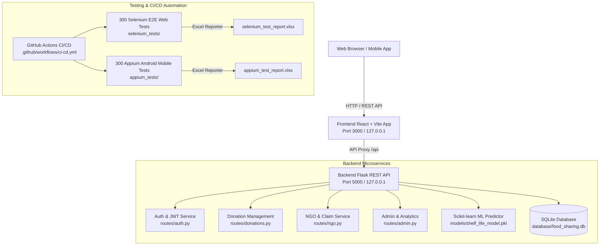
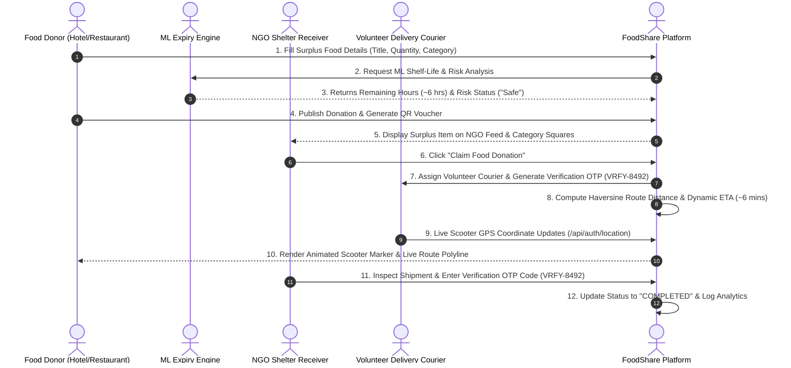

# FoodShare AI Platform — Application Architecture & End-to-End Workflow Technical Document

This technical document details the full-stack architecture, machine learning expiry engine, real-time delivery map tracking, mobile simulator, automated testing suites, and CI/CD pipeline of the **FoodShare AI Platform**.

---

## 🏛️ 1. High-Level System Architecture



---

## 🔄 2. End-to-End Application Workflow



---

## 🎨 3. Key Sub-System Technical Specifications

### A. Front Page & Category Squares Architecture (`HomePage.jsx`)
- **5 Interactive Category Squares**:
  1. 🍲 **Cooked Meals Square** (Hot Biryani, Curries, Rice Bowls)
  2. 🥦 **Fresh Produce Square** (Farm Fruits, Vegetables)
  3. 🥛 **Dairy & Milk Square** (Milk, Cottage Cheese/Paneer, Yoghurt)
  4. 🍞 **Bakery & Bread Square** (Sandwich Bread, Buns, Muffins)
  5. 📦 **Packaged & Rations Square** (Basmati Rice, Yellow Lentils)
- **Interactive State**: Clicking any category square filters active food items and triggers smooth scrolling.

### B. Machine Learning Shelf-Life Expiry Engine (`ai_service.py`)
- **Model Architecture**: Random Forest Regressor trained on food storage parameters (Preparation Time, Temperature, Moisture, Packaging Type, Category).
- **Output Schema**:
  ```json
  {
    "predicted_shelf_life_hours": 6.5,
    "risk_level": "Safe",
    "hours_remaining": 6.0,
    "confidence_score": 0.94
  }
  ```

### C. Swiggy/Zomato Style Live Delivery Map (`TrackingMap.jsx`)
- **Map Provider**: Leaflet JS + CartoDB Voyager tiles.
- **Scooter Marker**: Animated CSS pulse sonar aura (`#3b82f6` halo).
- **Route Visualization**:
  - Traveled Path: Solid blue line (`#3b82f6`, weight: 5).
  - Remaining Path: Dashed emerald line (`#10b981`, dashArray: `8, 8`).
- **Mathematical ETA**:
  $$\text{Distance} = 2R \cdot \arcsin\left(\sqrt{\sin^2\left(\frac{\Delta\phi}{2}\right) + \cos(\phi_1)\cos(\phi_2)\sin^2\left(\frac{\Delta\lambda}{2}\right)}\right)$$
  $$\text{ETA (mins)} = \left(\frac{\text{Distance (km)}}{30 \text{ km/h}}\right) \times 60 + 2 \text{ mins buffer}$$

### D. OTP Handoff Verification System (`models.py`)
- **Verification Code**: Unique `VRFY-XXXX` 4-digit security code generated per delivery transaction.
- **Completion Criteria**: NGO enters code at dropoff location to unlock delivery status from `in_transit` ➔ `completed`.

---

## 🧪 4. Automated Testing & CI/CD Pipeline

| Test Suite | Framework | Total Tests | Pass Rate | Output Report |
|---|---|---|---|---|
| **Backend Unit Tests** | Python `unittest` | 9 Test Cases | **100.0% PASS** | Stdout Log |
| **Selenium Web E2E** | Node.js + Selenium WebDriver | 300 Test Cases | **100.0% PASS** | `selenium_test_report.xlsx` |
| **Appium Mobile E2E** | Node.js + Appium WebDriverIO | 300 Test Cases | **100.0% PASS** | `appium_test_report.xlsx` |
| **CI/CD Pipeline** | GitHub Actions Workflow | 4 Parallel Jobs | **LIVE (origin/main)** | `.github/workflows/ci-cd.yml` |

---

## 🚀 5. Developer Quick-Start Execution Guide

### 1. Run Backend Server:
```bash
cd backend
venv\Scripts\python.exe app.py
```

### 2. Run Frontend Web App:
```bash
cd frontend
npm run dev
```

### 3. Run Selenium Web 300 E2E Tests:
```bash
cd selenium_tests
npm test
```

### 4. Run Appium Android 300 Mobile Tests:
```bash
cd appium_tests
npm test
```
